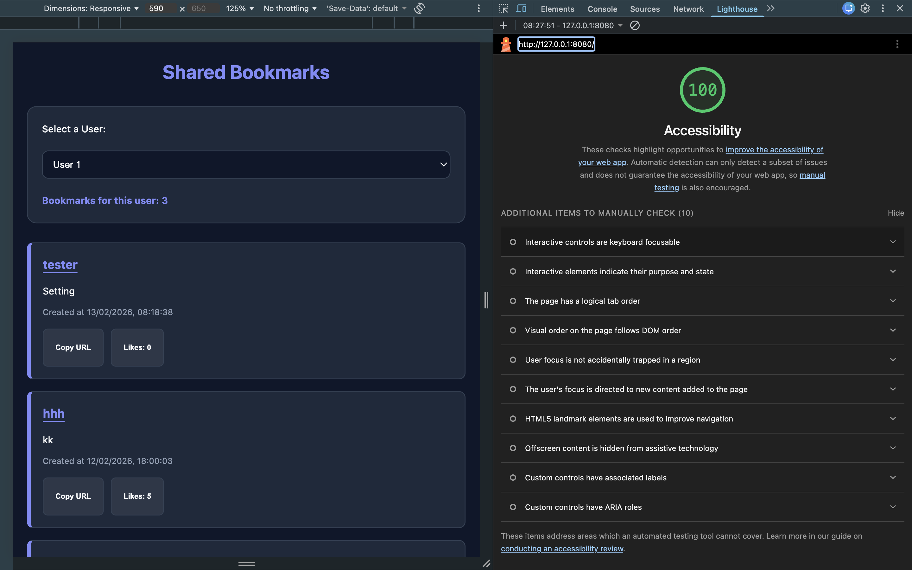

# Shared Bookmarks App

This is a collaborative bookmarking application developed as part of the CodeYourFuture Piscine. Users can select a profile, view saved links in reverse-chronological order, like bookmarks, and copy URLs to their clipboard.

## 🚀 Live Site

[Click here to view the deployed website](https://cyf-shared-bookmarks-iswat-and-chioma.netlify.app/)

## 🛠 Tech Stack

- Vanilla JavaScript (ES Modules)
- HTML5
- Jest (Unit Testing)
- Netlify (Automated Deployment)

## 💻 Local Setup

1. Clone this repository.
2. Ensure you have Node.js installed.
3. Open your terminal in the project directory and run:
   ```bash
   npm install
   npx http-server .
   ```
4. Open `http://localhost:8080` in your browser.

##Accessibility

This project achieves a score of 100 for Accessibility in Google Lighthouse.



## 🧪 Testing

- For unit test documentation, please see [TESTING.md](./TESTING.md).
- To run tests locally, use the command: `npm test`
